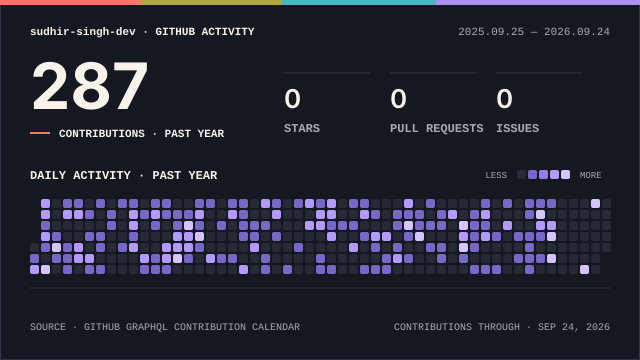

<div align="center">


<br/>


<br/><br/>

<a href="./Sudhir_Singh_Java_Developer_Resume.pdf">
  
</a>
<a href="https://sudhir-singh-dev-portfolio-blond.vercel.app/">
  
</a>
<a href="https://www.linkedin.com/in/sudhirsinghdev/">
  
</a>
<a href="mailto:sudhirsingh30041@gmail.com">
  
</a>
<a href="https://github.com/sudhir-singh-dev">
  
</a>

<br/><br/>


<br/><br/>


</div>

## 🟣 About Me

```yaml
name: "Sudhir Singh"
role: "Java Backend Developer"
experience: "3.8+ years"

domains:
  - Logistics & Shipment Tracking
  - Product Lifecycle Management (PLM)
  - Financial Services / Mutual Funds

core:
  - Java 8/17
  - Spring Boot
  - Spring MVC
  - Spring Data JPA
  - Hibernate/JPA
  - REST APIs
  - Microservices
  - SQL
  - Apache Kafka

security_and_api:
  - Spring Security
  - JWT
  - OAuth2
  - Swagger / OpenAPI
  - API Gateway

cloud_and_devops:
  - Docker
  - Kubernetes
  - Jenkins / CI-CD
  - AWS
  - OCI
  - Git / GitHub
  - Maven

testing:
  - JUnit 5
  - Mockito
  - Postman
  - Regression Testing
  - Debugging

currently_expanding:
  - AI Agent Development
  - Oracle AI Agent Studio
  - Oracle Cloud Infrastructure

open_to:
  - Java Backend Developer
  - Spring Boot Engineer
  - Microservices & Cloud Engineering
  - Enterprise Software Engineering
  - AI-enabled Backend Applications
```

I build enterprise backend systems focused on reliability, maintainability, API integration, performance, and production support — across shipment tracking, PLM integrations, and high-volume financial-services applications.

My engineering focus is on Java/Spring backend development, REST APIs, microservices, database optimization, asynchronous processing, automated testing, and cloud/container-based delivery.

<br/> <div align="center">  </div>
🟣 Tech Stack
<div align="center">
Languages

Frontend

Backend & Databases
 <br/>    
Messaging
 
Cloud, DevOps & Tooling
 <br/>     </div>

Core Java: OOP · Collections · Generics · Multithreading · Exception Handling · Stream API · Lambda Expressions · ExecutorService · Thread Pools · Design Patterns · SOLID Principles

Engineering Practice: REST API Development · Microservices · API Integration · Database Transactions · Query Optimization · Unit Testing · Regression Testing · Debugging · Agile/Scrum · Code Reviews · Git Branching/PRs · Backend Performance Optimization · Production Support

<br/> <div align="center">  </div>
🟣 AI / ML Expertise
Domain	Proficiency	Details
AI Foundations	▰▰▱▱▱ Foundation	Built through Oracle Cloud AI Foundations certification.
AI Agent Development	▰▰▱▱▱ Foundation	Oracle Foundation AI Agent Studio – Foundations Associate.
Cloud & AI	▰▰▱▱▱ Foundation	OCI foundation knowledge with an interest in enterprise AI use cases.
AI-Enabled Backend Engineering	▰▰▰▱▱ Developing	Exploring AI integration with Java, Spring Boot and REST APIs.

Current Direction: Combining strong Java backend engineering with cloud and AI capabilities to build practical enterprise applications.

<br/> <div align="center">  </div>
🟣 Featured Projects
<details open> <summary><strong>🔹 Shipment Tracking System — Logistics Platform</strong></summary> <br/>

Enterprise Shipment Tracking System focused on shipment visibility, package tracking, delivery workflows, REST APIs, microservices, database persistence, concurrent processing, automated testing, and production reliability.

Category	Details
Stack	Java 8 · Spring Boot · Spring MVC · Spring Data JPA · Hibernate/JPA · REST APIs · Microservices · MySQL
Scale	Data exchange across 3+ internal systems
Performance	Reduced batch-processing time by approximately 25% using ExecutorService, thread pools and multithreading
Security	Enterprise backend services with controlled API access and production-oriented service practices
Impact	80%+ unit-test coverage, approximately 30% fewer service disruptions, and 99.9% uptime
Repository	Private / Enterprise Project
Engineering Contributions
Built Java 8 and Spring Boot services for shipment status, package tracking, and delivery workflows.
Designed RESTful APIs and microservices for shipment visibility and delivery coordination.
Integrated backend data exchange across 3+ internal systems.
Implemented persistence using Spring Data JPA, Hibernate/JPA, SQL and MySQL.
Built JUnit 5 and Mockito tests achieving 80%+ coverage across core modules.
Optimized concurrent processing with ExecutorService and thread pools, reducing batch-processing time by approximately 25%.
Optimized MySQL queries and investigated backend issues, reducing service disruption by approximately 30%.
Supported build and delivery workflows using Maven, Git/GitHub, Docker, Kubernetes, Jenkins/CI-CD, AWS EC2 and S3.
</details> <details> <summary><strong>🔹 Enterprise PLM Application — Dell | Deloitte</strong></summary> <br/>

Enterprise Product Lifecycle Management application focused on backend development, API integration, workflow optimization, asynchronous processing and enterprise system connectivity.

Category	Details
Stack	Java 8 · Spring Boot · REST APIs · Spring Data JPA · Hibernate/JPA · SQL · Microservices · Apache Kafka · Zookeeper · Docker · Kubernetes · OCI
Scale	Enterprise data exchange across 5+ downstream systems
Performance	Reduced custom transformation code by approximately 30% and improved workflow cycle time by approximately 30%
Security	Enterprise API environment with controlled application integrations
Impact	Supported 10+ concurrent workflow events and reduced environment setup time by approximately 20%
Repository	Private / Enterprise Project
Engineering Contributions
Developed Java 8 and Spring Boot backend functionality and REST APIs.
Integrated application APIs with Spring Boot backend services and microservices.
Processed thousands of enterprise records per extraction run using Streams, Lambda and Collections.
Implemented Apache Kafka producer/consumer services with Zookeeper for asynchronous communication.
Supported workflows involving 10+ concurrent events.
Containerized backend services using Docker and deployed through Kubernetes.
Used Jenkins/CI-CD, GitHub, Maven and OCI for application build and delivery workflows.
Maintained a 100% on-time sprint delivery record across 6 consecutive sprints.
</details> <details> <summary><strong>🔹 WhiteOak & IDFC Mutual Fund Applications — Financial Services</strong></summary> <br/>

Enterprise financial-services applications supporting mutual fund workflows, daily NAV processing, backend business logic, REST APIs, high-volume database operations and downstream service communication.

Category	Details
Stack	Java · Spring Framework · Spring MVC · REST APIs · Hibernate/JPA · JDBC · Oracle · MySQL · SQL
Scale	Daily NAV processing for 2 fund houses and 100K+ records/day
Performance	Reduced API response latency by approximately 20%
Security	Database transactions and exception handling supporting data consistency
Impact	10+ modules, 5+ downstream services, approximately 15% fewer production data errors
Repository	Private / Enterprise Project
Engineering Contributions
Developed backend modules using Java, Spring MVC, REST APIs, Hibernate/JPA and JDBC.
Designed business logic across 10+ modules.
Built reusable REST API components returning JSON responses.
Supported backend communication across 5+ downstream services.
Supported workflows processing 100K+ records daily.
Optimized SQL across Oracle and MySQL, reducing API response latency by approximately 20%.
Applied database transactions and exception handling to maintain data consistency.
Reduced production data errors by an estimated 15%.
Participated in code reviews, testing, debugging and production issue resolution.
</details> <br/> <div align="center">  </div>
🟣 Experience
BO IT SOLUTIONS Pvt Ltd — Hyderabad

Java Backend Developer · Jan 2026 – Present

Developing backend services for an enterprise Shipment Tracking System with a focus on REST APIs, microservices, shipment workflows, database persistence, concurrent processing, automated testing and production reliability.

Key Scope

Java 8 + Spring Boot backend services
REST APIs and microservices
Spring Data JPA, Hibernate/JPA, SQL and MySQL
3+ internal-system integrations
JUnit 5 + Mockito
ExecutorService, thread pools and multithreading
Docker, Kubernetes and Jenkins/CI-CD
AWS EC2/S3
Production troubleshooting and performance optimization
Agile/Scrum collaboration

Java Spring Boot Spring MVC REST APIs Microservices JPA Hibernate MySQL JUnit 5 Mockito Docker Kubernetes Jenkins AWS

Deloitte — Bengaluru

Java Developer · Jun 2024 – Oct 2025

Delivered backend functionality and enterprise API integrations for an enterprise PLM-focused application, combining Java/Spring development, microservices, Kafka-based asynchronous processing, containerization and OCI-based delivery.

Key Scope

Java 8 + Spring Boot backend development
REST API integration
Spring Data JPA, Hibernate/JPA and SQL
5+ downstream-system integrations
Java Streams, Lambda, Collections and exception handling
Apache Kafka producer/consumer architecture
10+ concurrent workflow events
Docker + Kubernetes
Jenkins/CI-CD + GitHub + Maven + OCI
Workflow optimization and Agile/Scrum delivery

Java 8 Spring Boot REST APIs Microservices JPA Hibernate SQL Kafka Zookeeper Docker Kubernetes Jenkins Maven OCI

Sterling Software Pvt Ltd — Chennai

Java Developer · Jan 2022 – Jun 2023

Supported WhiteOak and IDFC Mutual Fund enterprise applications, working on backend business logic, REST APIs, database integrations, high-volume processing, application performance and production support.

Key Scope

Java + Spring MVC
REST APIs
Hibernate/JPA + JDBC
Oracle + MySQL
10+ backend modules
5+ downstream services
100K+ records processed daily
SQL optimization
Database transactions and exception handling
Maven + Git
Testing, debugging and code reviews
Agile/Scrum

Java Spring MVC REST APIs Hibernate JPA JDBC Oracle MySQL SQL Maven Git

<br/> <div align="center">  </div>
🟣 Achievements
<div align="center">
Recognition	Details
🏆 Enterprise API Integration Ownership	Owned a Spring Boot API integration connecting enterprise application data exchange with backend microservices.
⚙️ Enterprise Workflow Automation	Automated an enterprise workflow, reducing manual handling by approximately 35%.
🚨 Production Problem Solving	Diagnosed and resolved a production API/database issue, restoring stable backend processing within the same business day.
⚡ Rapid Technical Learning	Delivered a backend workflow customization after learning a new enterprise application SDK from scratch and receiving manager appreciation.
🤝 Team Collaboration	Supported technical troubleshooting and partnered with the frontend team to support on-time delivery.
</div> <br/> <div align="center">  </div>
🟣 Certifications
<div align="center">
Oracle
   </div> <br/> <div align="center">  </div>
🟣 Coding Profiles
<div align="center"> <a href="https://leetcode.com/u/sudhir10771/">  </a> <a href="https://www.hackerrank.com/profile/sudhirsingh30041">  </a> </div> <br/> <div align="center">  </div>
🟣 GitHub Analytics
<div align="center"> <picture> <source media="(prefers-color-scheme: dark)" srcset="./assets/profile/signal-field-wide-dark.svg" /> <source media="(prefers-color-scheme: light)" srcset="./assets/profile/signal-field-wide-light.svg" />  </picture>

<br/><br/>


</div> <br/> <div align="center">  </div>
🟣 Contribution Snake
<div align="center"> <picture> <source media="(prefers-color-scheme: dark)" srcset="https://raw.githubusercontent.com/sudhir-singh-dev/sudhir-singh-dev/output/github-snake-dark.svg" /> <source media="(prefers-color-scheme: light)" srcset="https://raw.githubusercontent.com/sudhir-singh-dev/sudhir-singh-dev/output/github-snake.svg" />  </picture> </div> <br/> <div align="center">  </div>


🟣 Connect With Me
<div align="center"> <a href="./Sudhir_Singh_Java_Developer_Resume.pdf">  </a> <a href="mailto:sudhirsingh30041@gmail.com">  </a> <a href="https://www.linkedin.com/in/sudhirsinghdev/">  </a> <a href="https://github.com/sudhir-singh-dev">  </a> <a href="https://sudhir-singh-dev-portfolio-blond.vercel.app/">  </a> </div> <br/> <div align="center">

<em>"Building reliable backend systems with clean architecture, measurable impact, and continuous learning."</em>

<br/><br/>

 </div>
